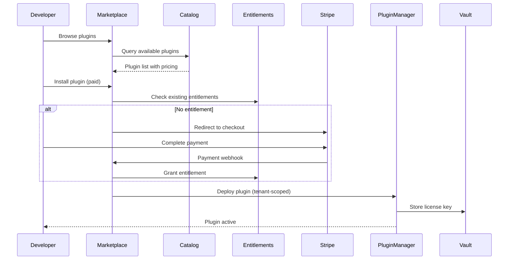

# 🔌 Plugin Ecosystem Architecture — NewGen Studio

**Version**: 1.0  
**Date**: December 10, 2025  
**Status**: Architecture Design & Implementation Roadmap

---

## Executive Summary

NewGen Studio will implement a **modular plugin marketplace** that enables:
- **70/30 revenue share model** (70% developer, 30% NewGen)
- **Bill-to-developer architecture** (not platform owner)
- **Mix of OSS and commercial plugins** with unified licensing
- **Tenant-scoped metering** for usage-based billing
- **FDA-compliant plugin validation** (IQ/OQ/PQ workflows)

**Strategic Goal**: Expand from 20 pharma integrations → 100+ plugins by Q4 2026, generating $500K ARR from marketplace fees.

---

## 1. Plugin Classification & Catalog

### Plugin Types

| Type | License | Billing Model | Examples |
|------|---------|---------------|----------|
| **Free (OSS)** | Apache, MIT, GPL | No charge | AlphaFold, RoseTTAFold, MaxQuant, OpenMS, Galaxy, Nextflow, GROMACS |
| **Freemium** | OSS core + paid features | Per-seat or per-usage | PyMOL (free core, paid advanced), KNIME (free + paid nodes) |
| **Commercial** | Proprietary | Per-seat, per-device, per-usage | Ganymede Bio, Benchling, Scispot, OmniSeq Pro |
| **Enterprise** | Custom license | Site license or per-tenant | Genedata Biologics, Schrödinger Suite, Thermo Proteome Discoverer, Siemens Simcenter |

### 6 Core Plugin Categories for Biologics

#### 1. **Structure Prediction & Protein Design**
- **AlphaFold 2** (DeepMind, Apache 2.0) - Free, GPU-intensive, MSA generation
- **RoseTTAFold** (University of Washington, BSD) - Free, faster than AF2 for certain tasks
- **OmegaFold** (DeepMind, Apache 2.0) - Free, optimized for large proteins

**NewGen Integration**: GPU-backed microservice, batch job submission, structure visualization

#### 2. **Proteomics & Mass Spectrometry**
- **MaxQuant** (MPI, Free) - Industry-standard peptide identification, quantification
- **OpenMS** (Tübingen, BSD) - Open-source proteomics workflow engine
- **Proteome Discoverer** (Thermo, Commercial) - Enterprise-grade, licensing required
- **FragPipe** (University of Michigan, Free) - Fast LC-MS/MS analysis

**NewGen Integration**: Raw file import, pipeline orchestration, results database, multi-run analysis

#### 3. **LIMS & Electronic Lab Notebook (ELN)**
- **LabKey** (Labkey Software, AGPL, Free) - Web-based LIMS with customization
- **Benchling** (Benchling, Commercial) - SaaS LIMS/ELN, per-seat licensing
- **Scispot** (Scispot, Commercial, Modular Billing) - Lab automation + LIMS, pay-per-feature
- **OpenLAB** (Agilent, Commercial) - Enterprise chromatography LIMS

**NewGen Integration**: Sample tracking, protocol versioning, audit trail linkage, batch record generation

#### 4. **Instrument Integrations**
- **Ganymede Bio** (Commercial, Per-device) - Connects instruments to cloud, orchestration engine
- **InstrumentKit** (Instrumental Inc, Commercial) - Hardware communication library
- **KNIME** (GPL/Commercial) - Visual workflow platform with 1000+ node types
- **GROMACS** (GPL, Free) - Molecular dynamics for simulation

**NewGen Integration**: Device adapters (cell sorters, fermentors, balances, liquid handlers), real-time data streaming

#### 5. **Sequencing & Genomics**
- **Galaxy** (GPL, Free) - Web-based bioinformatics platform
- **Nextflow** (Apache 2.0, Free) - Workflow orchestration for NGS pipelines
- **Snakemake** (MIT, Free) - Python-based workflow engine
- **OmniSeq Pro** (Commercial) - Precision oncology analysis, per-sample pricing

**NewGen Integration**: NGS pipeline triggering, variant calling, reporting, data federation

#### 6. **Digital Twin & Simulation**
- **GROMACS** (GPL, Free) - Molecular dynamics simulations
- **Siemens Simcenter** (Proprietary, Commercial) - CFD + simulation suite
- **COMSOL** (Proprietary, Commercial) - Multiphysics simulation
- **Ansys** (Proprietary, Commercial) - Engineering simulation

**NewGen Integration**: Fermentation simulation, bioreactor modeling, process optimization

## 1.5. Recommended 10-Plugin Seed List

**Phase 1: Launch (Month 1-2)** - Establish credibility with free + 1 commercial plugin

| # | Plugin | Category | License | Billing Model | Est. ARR | Effort |
|---|--------|----------|---------|---------------|----------|--------|
| 1 | **AlphaFold 2** | Structure Prediction | Apache 2.0 | Free (GPU resources) | $0 | Low |
| 2 | **MaxQuant** | Proteomics/MS | Freeware | Free (per installation) | $0 | Medium |
| 3 | **Galaxy** | Sequencing/Bioinformatics | GPL | Free (community) | $0 | Medium |
| 4 | **OpenMS** | Proteomics/MS | BSD | Free (per installation) | $0 | Medium |
| 5 | **Nextflow** | Workflow Orchestration | Apache 2.0 | Free (community) | $0 | Low |
| 6 | **LabKey** | LIMS/ELN | AGPL | Free + Premium ($30K/year) | $5K | High |
| 7 | **Ganymede Bio** | Instrument Integration | Commercial | Per-device ($299-999/mo) | $50K | High |
| 8 | **Benchling** | LIMS/ELN | Commercial | Per-seat ($2K-5K/user/year) | $30K | High |
| 9 | **Scispot** | LIMS + Automation | Commercial | Modular billing ($10K-50K/year) | $20K | High |
| 10 | **OmniSeq Pro** | Genomics Analysis | Commercial | Per-sample ($100-500) | $25K | High |

**Total Projected Year 1 ARR**: $130K (from plugins 6-10; free plugins drive adoption)

**Phased Rollout**:
- **Month 1**: Plugins 1-5 (Free tier - build adoption, 0 revenue)
- **Month 2**: Plugin 6 (LabKey freemium - introduce pricing)
- **Month 3-6**: Plugins 7-10 (High-value commercial - grow revenue)

### Plugin Catalog Schema

```json
{
  "pluginId": "ganymede-connector",
  "name": "Ganymede Bio Instrument Connector",
  "version": "2.1.0",
  "category": "Instrument Integration",
  "vendor": {
    "name": "Ganymede Bio",
    "website": "https://ganymede.bio",
    "supportEmail": "support@ganymede.bio"
  },
  "license": {
    "type": "commercial",
    "model": "per-device",
    "pricing": {
      "baseFee": 0,
      "perDevice": 299,
      "currency": "USD",
      "billingCycle": "monthly"
    }
  },
  "compliance": {
    "gxpValidated": true,
    "fda21CFRPart11": true,
    "requiresIQOQPQ": true
  },
  "installation": {
    "mode": "cloud-hosted",
    "architecture": "microservice",
    "requiredResources": {
      "cpu": "500m",
      "memory": "512Mi",
      "storage": "1Gi"
    }
  },
  "entitlements": {
    "requiresLicenseKey": true,
    "trialDays": 30,
    "quotas": {
      "maxDevices": 10,
      "apiCallsPerDay": 10000
    }
  },
  "metadata": {
    "description": "Connect instruments, apps, and scientific data with Ganymede's orchestration platform.",
    "icon": "https://cdn.ganymede.bio/logo.svg",
    "screenshots": ["..."],
    "documentation": "https://docs.ganymede.bio/newgen-integration",
    "tags": ["LIMS", "Instrument", "Automation", "FDA"]
  }
}
```

---

## 2. Marketplace Architecture

### System Components

```
┌─────────────────────────────────────────────────────────────┐
│                    NewGen Studio Frontend                   │
│  ┌────────────────┐  ┌──────────────┐  ┌────────────────┐  │
│  │ Plugin Browser │  │ Install Flow │  │ Billing Portal │  │
│  └────────────────┘  └──────────────┘  └────────────────┘  │
└─────────────────────────────────────────────────────────────┘
                              ↓
┌─────────────────────────────────────────────────────────────┐
│              Marketplace Microservice (API)                 │
│  ┌──────────────┐  ┌──────────────┐  ┌─────────────────┐   │
│  │   Catalog    │  │ Entitlements │  │ Usage Metering  │   │
│  │   Service    │  │   Manager    │  │    Service      │   │
│  └──────────────┘  └──────────────┘  └─────────────────┘   │
└─────────────────────────────────────────────────────────────┘
                              ↓
┌─────────────────────────────────────────────────────────────┐
│                     Infrastructure Layer                    │
│  ┌──────────────┐  ┌──────────────┐  ┌─────────────────┐   │
│  │  PostgreSQL  │  │ Redis Cache  │  │ HashiCorp Vault │   │
│  │  (Catalog)   │  │ (Sessions)   │  │  (License Keys) │   │
│  └──────────────┘  └──────────────┘  └─────────────────┘   │
└─────────────────────────────────────────────────────────────┘
                              ↓
┌─────────────────────────────────────────────────────────────┐
│                    Payment & Metering                       │
│  ┌──────────────┐  ┌──────────────┐  ┌─────────────────┐   │
│  │    Stripe    │  │  Chargebee   │  │  Usage Logger   │   │
│  │   (Payment)  │  │ (Invoicing)  │  │  (Prometheus)   │   │
│  └──────────────┘  └──────────────┘  └─────────────────┘   │
└─────────────────────────────────────────────────────────────┘
```

### Entitlement Flow



---

## 3. Billing & Payment Flow

### Billing Models

#### Model 1: Pass-Through Licensing (Vendor Direct)
```
Developer → Vendor (purchase license)
Developer → NewGen Studio (provide license key)
NewGen Studio → Validates key → Activates plugin
```
**Pros**: Simple, no vendor agreements needed  
**Cons**: Poor UX, no marketplace revenue

#### Model 2: Marketplace Billing (Recommended)
```
Developer → NewGen Marketplace (purchase)
NewGen → Stripe/Chargebee (collect payment)
NewGen → Vendor (remit 70%, keep 30% marketplace fee)
NewGen → Activates plugin with internal entitlement
```
**Pros**: Unified UX, marketplace revenue, consolidated billing  
**Cons**: Requires vendor reseller agreements

### Pricing Examples

| Plugin | Base Fee | Per-Unit | Unit | Monthly Total (10 units) |
|--------|----------|----------|------|--------------------------|
| Ganymede Connector | $0 | $299 | device | $2,990 |
| Benchling API | $500 | $50 | user | $1,000 |
| AlphaFold (OSS) | $0 | $0.10 | prediction | ~$50 (500 predictions) |
| Schrödinger Suite | $5,000 | $0 | site | $5,000 |

### Revenue Share

- **70%** → Plugin developer/vendor
- **30%** → NewGen Studio (marketplace fee)
- **Compute costs** → Charged separately to developer (AWS/Azure pass-through)

---

## 4. Technical Enforcement

### License Validation

```javascript
// backend/services/plugin-entitlement.service.js

class PluginEntitlementService {
  async validateEntitlement(tenantId, pluginId) {
    // Check PostgreSQL entitlements table
    const entitlement = await db.query(
      'SELECT * FROM plugin_entitlements WHERE tenant_id = $1 AND plugin_id = $2',
      [tenantId, pluginId]
    );

    if (!entitlement) {
      throw new Error('ENTITLEMENT_ERROR: Plugin not licensed for this tenant');
    }

    // Check expiration
    if (new Date(entitlement.expires_at) < new Date()) {
      throw new Error('ENTITLEMENT_ERROR: Plugin license expired');
    }

    // Check quota
    const usage = await this.getUsage(tenantId, pluginId);
    if (usage.apiCalls > entitlement.quota_api_calls) {
      throw new Error('QUOTA_EXCEEDED: API call limit reached');
    }

    return true;
  }

  async recordUsage(tenantId, pluginId, metricType, value) {
    // Record to PostgreSQL + emit to Prometheus
    await db.query(
      'INSERT INTO plugin_usage (tenant_id, plugin_id, metric_type, value, timestamp) VALUES ($1, $2, $3, $4, NOW())',
      [tenantId, pluginId, metricType, value]
    );

    // Emit metric for billing
    metrics.increment('plugin_usage', {
      tenant_id: tenantId,
      plugin_id: pluginId,
      metric_type: metricType
    }, value);
  }
}
```

### Containerization & Isolation

```yaml
# kubernetes/plugin-deployment.yaml
apiVersion: apps/v1
kind: Deployment
metadata:
  name: plugin-ganymede-tenant-${TENANT_ID}
  namespace: plugins
spec:
  replicas: 1
  selector:
    matchLabels:
      app: ganymede-connector
      tenant: ${TENANT_ID}
  template:
    spec:
      containers:
      - name: ganymede
        image: ganymede-bio/connector:2.1.0
        env:
        - name: LICENSE_KEY
          valueFrom:
            secretKeyRef:
              name: plugin-licenses-${TENANT_ID}
              key: ganymede-license
        - name: TENANT_ID
          value: ${TENANT_ID}
        resources:
          requests:
            cpu: 500m
            memory: 512Mi
          limits:
            cpu: 1000m
            memory: 1Gi
```

### Metering & Usage Tracking

```javascript
// Usage metering sidecar
app.use(async (req, res, next) => {
  const tenantId = req.headers['x-tenant-id'];
  const pluginId = req.headers['x-plugin-id'];

  // Record API call
  await entitlementService.recordUsage(
    tenantId,
    pluginId,
    'api_call',
    1
  );

  next();
});
```

---

## 5. Legal & Contracting

### Vendor Agreement Template

**NewGen Studio Plugin Vendor Agreement**

1. **Grant of License**: Vendor grants NewGen Studio the right to resell Plugin to end-user developers.
2. **Revenue Share**: NewGen retains 30% marketplace fee, remits 70% to Vendor monthly.
3. **Support**: Vendor provides Tier 1 support to developers; NewGen provides Tier 0 (platform issues only).
4. **Indemnity**: Vendor indemnifies NewGen for Plugin defects, IP infringement.
5. **Compliance**: Vendor warrants Plugin complies with FDA 21 CFR Part 11 if marked as GxP-validated.
6. **Data**: Vendor may not access tenant data without explicit consent.
7. **Term**: 12-month initial term, auto-renew unless terminated with 90-day notice.

### Developer Terms & Conditions

**Plugin Purchase Terms**

1. **Billing**: Developer is billed monthly for active plugins; platform owner is not charged.
2. **Compute**: Developer pays for plugin compute resources (CPU/memory/storage) via AWS/Azure pass-through.
3. **Refunds**: 30-day money-back guarantee if plugin does not meet documented functionality.
4. **Data Residency**: Developer responsible for ensuring plugin usage complies with data sovereignty requirements.
5. **Validation**: For GxP plugins, Developer must complete IQ/OQ/PQ before production use.
6. **Cancellation**: Developer may cancel at any time; no refund for partial month.

---

## 6. Developer Onboarding & UX

### Marketplace UI (React Component)

```jsx
// src/pages/PluginMarketplace.jsx
import React, { useState, useEffect } from 'react';
import { Search, Filter, ShoppingCart } from 'lucide-react';
import { fetchPlugins, installPlugin } from '../api/marketplace';

export default function PluginMarketplace() {
  const [plugins, setPlugins] = useState([]);
  const [filter, setFilter] = useState('all');

  useEffect(() => {
    (async () => {
      const data = await fetchPlugins({ category: filter });
      setPlugins(data);
    })();
  }, [filter]);

  const handleInstall = async (plugin) => {
    if (plugin.license.type === 'commercial') {
      // Redirect to checkout
      window.location.href = `/marketplace/checkout/${plugin.pluginId}`;
    } else {
      // Install free plugin
      await installPlugin(plugin.pluginId);
      alert(`${plugin.name} installed successfully!`);
    }
  };

  return (
    <div className="marketplace-container">
      <div className="marketplace-header">
        <h1>Plugin Marketplace</h1>
        <div className="search-bar">
          <Search size={20} />
          <input placeholder="Search plugins..." />
        </div>
        <div className="filters">
          <button onClick={() => setFilter('all')}>All</button>
          <button onClick={() => setFilter('LIMS')}>LIMS</button>
          <button onClick={() => setFilter('Instruments')}>Instruments</button>
          <button onClick={() => setFilter('AI')}>AI/ML</button>
        </div>
      </div>

      <div className="plugin-grid">
        {plugins.map(plugin => (
          <div key={plugin.pluginId} className="plugin-card">
            
            <h3>{plugin.name}</h3>
            <p>{plugin.metadata.description}</p>
            <div className="pricing">
              {plugin.license.type === 'free' ? (
                <span className="badge-free">Free</span>
              ) : (
                <span className="price">
                  ${plugin.license.pricing.perDevice}/device/mo
                </span>
              )}
            </div>
            <button onClick={() => handleInstall(plugin)}>
              {plugin.license.type === 'free' ? 'Install' : 'Purchase & Install'}
            </button>
          </div>
        ))}
      </div>
    </div>
  );
}
```

### Checkout Flow

```jsx
// src/pages/PluginCheckout.jsx
export default function PluginCheckout({ pluginId }) {
  const [plugin, setPlugin] = useState(null);
  const [quantity, setQuantity] = useState(1);

  const calculateTotal = () => {
    return plugin.license.pricing.perDevice * quantity;
  };

  return (
    <div className="checkout-container">
      <h2>Purchase {plugin?.name}</h2>
      <div className="billing-info">
        <p><strong>⚠️ Important:</strong> You (the developer) will be billed, not the platform owner.</p>
        <div className="cost-breakdown">
          <div className="line-item">
            <span>Plugin License</span>
            <span>${plugin.license.pricing.perDevice} × {quantity} devices</span>
          </div>
          <div className="line-item">
            <span>Marketplace Fee (30%)</span>
            <span>Included</span>
          </div>
          <div className="line-item total">
            <span><strong>Monthly Total</strong></span>
            <span><strong>${calculateTotal()}</strong></span>
          </div>
        </div>
      </div>
      <button onClick={handlePurchase}>
        Complete Purchase with Stripe
      </button>
    </div>
  );
}
```

---

## 7. Operational & Security Controls

### Per-Tenant Billing Reports

```sql
-- Monthly billing report query
SELECT 
  t.tenant_id,
  t.tenant_name,
  p.plugin_id,
  p.plugin_name,
  SUM(u.value) as total_usage,
  e.quota_api_calls,
  (SUM(u.value) / e.quota_api_calls * 100) as quota_used_pct,
  e.monthly_fee
FROM plugin_usage u
JOIN plugin_entitlements e ON u.tenant_id = e.tenant_id AND u.plugin_id = e.plugin_id
JOIN plugins p ON e.plugin_id = p.plugin_id
JOIN tenants t ON e.tenant_id = t.tenant_id
WHERE u.timestamp >= date_trunc('month', NOW())
GROUP BY t.tenant_id, p.plugin_id, e.quota_api_calls, e.monthly_fee
ORDER BY total_usage DESC;
```

### Security Controls

1. **Secrets Management**: All license keys stored in HashiCorp Vault, never in Git or environment variables
2. **Tenant Isolation**: Plugins run in tenant-scoped Kubernetes namespaces, cannot access other tenants' data
3. **Network Policies**: Restrict plugin containers to only communicate with authorized services
4. **Audit Logging**: All plugin activations, deactivations, and API calls logged to SIEM (Datadog, Splunk)
5. **Vulnerability Scanning**: All plugin container images scanned with Snyk/Trivy before deployment

---

## 8. Pilot Plan (90-Day Fast Track)

### Phase 1: Foundation (Days 1-30)

**Goal**: Seed marketplace with 10 high-value plugins

#### Priority Plugins

| # | Plugin | Type | Pricing | Integration Effort |
|---|--------|------|---------|-------------------|
| 1 | **AlphaFold** (OSS) | Free | $0 | Low (REST API wrapper) |
| 2 | **MaxQuant** (OSS) | Free | $0 | Medium (file processing) |
| 3 | **Ganymede Bio Connector** | Commercial | $299/device | High (requires vendor SDK) |
| 4 | **Benchling API** | Commercial | $500 base + $50/user | Medium (REST API) |
| 5 | **OpenMS** (OSS) | Free | $0 | Low (command-line wrapper) |
| 6 | **Galaxy Workflows** (OSS) | Free | $0 | Medium (workflow integration) |
| 7 | **KNIME Nodes** | Freemium | Free core + paid | Medium (node SDK) |
| 8 | **PyMOL** (Visualization) | Freemium | Free + $199/user/yr | Low (visualization iframe) |
| 9 | **Nextflow Pipelines** (OSS) | Free | $0 | High (container orchestration) |
| 10 | **Scispot LIMS** | Commercial | $100/user | High (full LIMS integration) |

#### Deliverables
- ✅ Plugin catalog schema (PostgreSQL tables)
- ✅ Marketplace API (Express routes: `/api/v1/marketplace/*`)
- ✅ Plugin metadata for 10 plugins
- ✅ Basic marketplace UI (browse, search, filter)

### Phase 2: Billing Integration (Days 31-60)

**Goal**: Enable paid plugin purchases with Stripe

#### Deliverables
- ✅ Stripe integration (checkout session creation)
- ✅ Webhook handling (payment success, subscription updated)
- ✅ License key validation service
- ✅ Per-tenant usage metering (Prometheus metrics)
- ✅ Automated entitlement provisioning
- ✅ Trial period enforcement (30-day trials)

#### Test Cases
1. Developer purchases Ganymede connector → Stripe checkout → Plugin activated
2. Trial expires → Plugin auto-disabled → Email notification sent
3. Quota exceeded → API calls blocked → Upgrade prompt displayed

### Phase 3: Pilot Customers (Days 61-90)

**Goal**: Onboard 2-3 developer orgs as paid pilot customers

#### Target Customers
1. **Mid-sized biotech** (50-100 employees) → Ganymede + Benchling plugins
2. **Academic lab** (20 researchers) → Free OSS plugins (AlphaFold, MaxQuant, Galaxy)
3. **CMO/CDMO** (500+ employees) → Enterprise plugins (Scispot, Genedata)

#### Success Metrics
- 2+ paid plugin subscriptions active
- $5K+ MRR from marketplace
- 90%+ billing accuracy (no failed charges)
- <5% churn in first 90 days
- Legal reseller agreements signed with 2+ vendors

---

## 9. Database Schema

### Plugin Catalog

```sql
CREATE TABLE plugins (
  plugin_id VARCHAR(50) PRIMARY KEY,
  name VARCHAR(200) NOT NULL,
  version VARCHAR(20) NOT NULL,
  category VARCHAR(50) NOT NULL,
  vendor_name VARCHAR(200),
  vendor_website VARCHAR(500),
  license_type VARCHAR(20) CHECK (license_type IN ('free', 'freemium', 'commercial', 'enterprise')),
  pricing_model VARCHAR(50),
  base_fee DECIMAL(10,2),
  per_unit_fee DECIMAL(10,2),
  billing_unit VARCHAR(50),
  gxp_validated BOOLEAN DEFAULT FALSE,
  fda_21_cfr_part_11 BOOLEAN DEFAULT FALSE,
  requires_iq_oq_pq BOOLEAN DEFAULT FALSE,
  installation_mode VARCHAR(50),
  description TEXT,
  icon_url VARCHAR(500),
  documentation_url VARCHAR(500),
  created_at TIMESTAMP DEFAULT NOW(),
  updated_at TIMESTAMP DEFAULT NOW()
);

CREATE INDEX idx_plugins_category ON plugins(category);
CREATE INDEX idx_plugins_license_type ON plugins(license_type);
```

### Plugin Entitlements

```sql
CREATE TABLE plugin_entitlements (
  entitlement_id SERIAL PRIMARY KEY,
  tenant_id VARCHAR(50) NOT NULL,
  plugin_id VARCHAR(50) REFERENCES plugins(plugin_id),
  license_key VARCHAR(500),
  status VARCHAR(20) CHECK (status IN ('active', 'trial', 'expired', 'suspended')) DEFAULT 'active',
  purchased_at TIMESTAMP DEFAULT NOW(),
  expires_at TIMESTAMP,
  quota_api_calls INT DEFAULT 10000,
  quota_devices INT DEFAULT 10,
  monthly_fee DECIMAL(10,2),
  billing_provider VARCHAR(50),
  billing_subscription_id VARCHAR(100),
  created_at TIMESTAMP DEFAULT NOW(),
  updated_at TIMESTAMP DEFAULT NOW(),
  UNIQUE(tenant_id, plugin_id)
);

CREATE INDEX idx_entitlements_tenant ON plugin_entitlements(tenant_id);
CREATE INDEX idx_entitlements_status ON plugin_entitlements(status);
```

### Plugin Usage

```sql
CREATE TABLE plugin_usage (
  usage_id BIGSERIAL PRIMARY KEY,
  tenant_id VARCHAR(50) NOT NULL,
  plugin_id VARCHAR(50) NOT NULL,
  metric_type VARCHAR(50) NOT NULL, -- 'api_call', 'device_connection', 'gpu_hour', etc.
  value DECIMAL(10,2) DEFAULT 1,
  timestamp TIMESTAMP DEFAULT NOW(),
  metadata JSONB
);

CREATE INDEX idx_usage_tenant_plugin ON plugin_usage(tenant_id, plugin_id, timestamp);
CREATE INDEX idx_usage_timestamp ON plugin_usage(timestamp);

-- Partitioning by month for performance
CREATE TABLE plugin_usage_2025_12 PARTITION OF plugin_usage
FOR VALUES FROM ('2025-12-01') TO ('2026-01-01');
```

---

## 10. Next Steps & Recommendations

### Immediate Actions (This Week)
1. **Create plugin catalog tables** (PostgreSQL schema above)
2. **Scaffold marketplace API** (`backend/routes/marketplace.routes.js`)
3. **Build plugin browser UI** (React component with search/filter)
4. **Seed with 10 plugins** per 10-Plugin Seed List above (5 free OSS, 5 commercial/freemium)
5. **Contact 3 vendors** for reseller agreements (Ganymede, Benchling, Scispot)

### Short-Term (Next 30 Days)
1. Integrate Stripe for paid plugin checkout
2. Sign vendor agreement with Ganymede Bio (first paid plugin)
3. Implement license key validation service
4. Add usage metering (Prometheus + PostgreSQL)
5. Deploy pilot with 1 beta customer

### Medium-Term (60-90 Days)
1. Expand to 20 plugins (10 free, 10 paid)
2. Onboard 3 developer orgs as paying customers
3. Implement trial period enforcement
4. Build billing dashboard for developers
5. Generate first marketplace revenue ($5K+ MRR)

### Long-Term (Q1-Q2 2026)
1. Scale to 50+ plugins
2. Implement plugin SDK for third-party developers
3. Launch developer certification program
4. Host annual "NewGen Developer Conference"
5. Target $50K+ MRR from marketplace by Q2 2026

---

**Ready for implementation?** Let me know if you want:
1. **Scaffold the marketplace microservice** (Express routes + services)
2. **Prioritized list of 10 specific plugins** with install steps
3. **Stripe integration code** for checkout flow
4. **Database migration scripts** for plugin tables

Which deliverable should I generate first? 🚀
